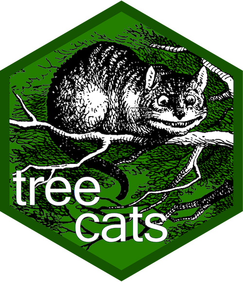

<!-- README.md is generated from README.Rmd. Please edit that file -->

```{r, echo = FALSE}
knitr::opts_chunk$set(
  collapse = TRUE,
  comment = "#>",
  fig.path = "README-"
)
```

# treecats 

[](https://travis-ci.org/bocinsky/treecats)
[](https://codecov.io/github/bocinsky/treecats?branch=master)
[](https://cran.r-project.org/package=treecats)

The `treecats` package defines a new subclass of an ordered factor---"trees"---
that are simple tree-like ontologies where values lower on
the tree inherit values above. `treecats` allows for the creation of 
tree factors, and provides functions for their basic manipulation including
querying up and down the tree, collapsing to a level, and dropping unused levels.

"treecats" stands for "tree categories." Yes, the package and its name is inspired by Hadley Wickham's [`forcats`](http://forcats.tidyverse.org/).

## Installation

You can install treecats from github with:

```{r gh-installation, eval = FALSE}
# install.packages("devtools")
devtools::install_github("bocinsky/treecats")

```

## Example


```{r example}
library(treecats)
c("John","Kyle","Molly") %>%
  tct_tree()
  
```


## Contributor Code of Conduct
Please note that this project is released with a [Contributor Code of Conduct](CONDUCT.md). By participating in this project you agree to abide by its terms.
